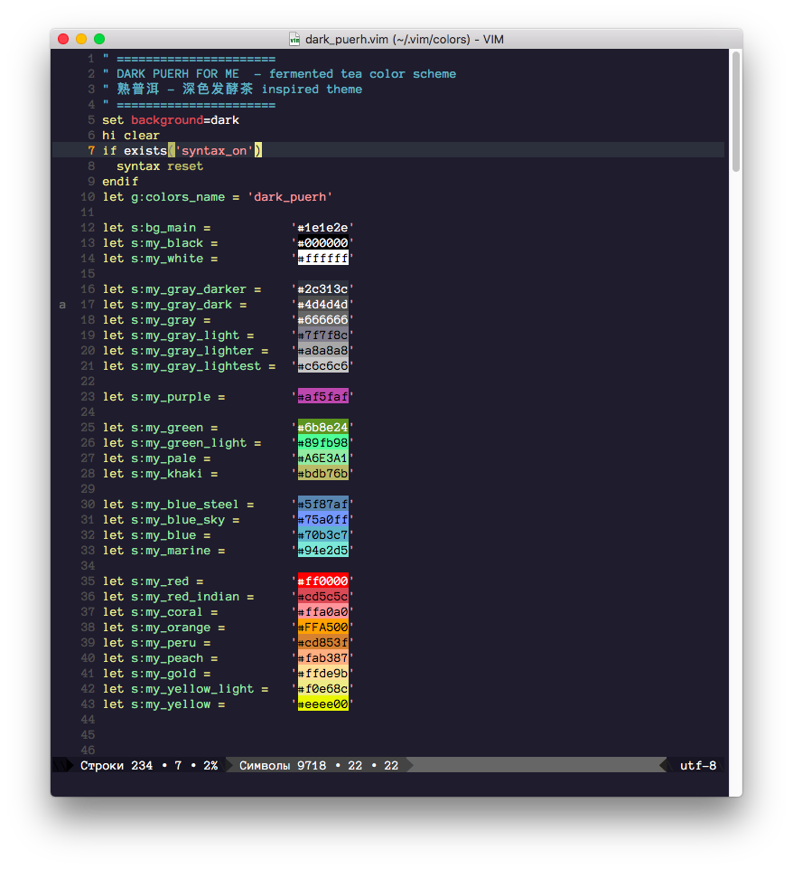

# dark_puerh.vim

熟普洱 - 深色发酵茶

DARK PUERH FOR ME  - fermented tea vim color scheme 



## Installation

```HTML
curl -o ~/.vim/colors/dark_puerh.vim https://raw.githubusercontent.com/da0ab/dark_puerh.vim/master/colors/dark_puerh.vim
```

## Running

To load the color scheme run

```HTML
:colorscheme dark_puerh
```

To always use the dark_puerh color scheme add the following line to your .vimrc

```HTML
colorscheme dark_puerh
```
